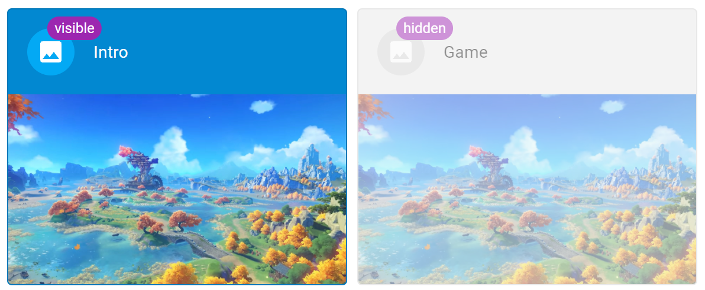

# obs-remote

A touch-friendly desktop application designed for tablets that can be used to control OBS Studio remotely using `obs-websocket`.

[](https://github.com/rbuckton/obs-remote/actions/workflows/nightly.yml)

# Installation

## Prerequisites

### Installing the `obs-websocket` Plugin

Before you can use `obs-remote`, you first need to install the `obs-websocket` plugin for OBS Studio on the machine running OBS:

- <https://github.com/Palakis/obs-websocket#downloads>

`obs-remote` requires a version of `obs-websocket` between 4.8.0 and 4.9.1. 

### Setting a Password for `obs-websocket`

It is recommended that you set a password for `obs-websocket` in OBS Studio:

1. In the OBS Studio menu, click `Tools > Websocket server settings`.
2. Enable authentication and set a password.
   - NOTE: You will need this password when connecting via `obs-remote` later.

## Downloading `obs-remote`

You can find the latest version of `obs-remote` in the [Releases](https://github.com/rbuckton/obs-remote/releases) tab.

> NOTE: The `nightly` release is the most recent, but least stable release. It is generated each night from the latest sources in `main`.

> NOTE: Releases aren't currently signed. I'm working on that...

# Usage

## Connecting to OBS Studio

The first time you start `obs-remote`, you'll be presented with the connection screen:


1. Provide the following options:
   - **Hostname** &mdash; The machine name, host name, or IP address of the computer running OBS Studio and `obs-websocket`.
   - **Port** &mdash; The port number for `obs-websocket` (see `Tools > Websocket server settings` in OBS Studio).
   - **Auth Key** &mdash; The password for `obs-websocket` (see `Tools > Websocket server settings` in OBS Studio). Leave blank if authentication is disabled.
     - WARNING: The password is stored in plain text on the machine running `obs-remote`.
   - **Automatically Connect** &mdash; Automatically connect to the remote machine on startup.
2. Click `CONNECT` to connect to the remote OBS Studio instance.
   - NOTE: OBS Studio must already be running on the remote machine.

> NOTE: You can use the `DEMO` button to try out the dashboard without connecting to OBS.

## Dashboard

Once connected you can manage OBS Studio remotely from the dashboard:


The Dashboard is broken down into 4 main sections:

- Menu and Tools
- Stream/Recording Manager
- Scene Switcher
- Audio Source Controls

### Menu and Tools


The Menu and Tools app bar can be used to control the following behaviors:

- Open the Menu to view connection information or disconnect
- Enter or exit "Visibility Editor" mode
- Switch between Light and Dark mode
- Enter or exit Fullscreen mode
  - NOTE: When in Fullscreen mode, the application will prevent the system from going to sleep.

### Stream/Recording Manager


The Stream/Recording Manager bar gives you quick access to:

- Start or stop a live stream
- Start, stop, or pause a recording
- Start, stop, and save the replay buffer

### Scene Switcher


The scene switcher gives you a preview of your available scenes in OBS and allows you to quickly switch between scenes.

#### "Visibility Editor" mode

When in the "Visibility Editor" mode, scenes will be tagged with whether they are visible or hidden from `obs-remote`. Clicking a Scene will change its visibility state:



> NOTE: The visiblity state of a Scene is stored in the scene settings in OBS Studio, but does not affect the visibility of the scene in OBS Studio itself, only in `obs-remote`.

### Audio Source Controls


The Audio Source Controls bar gives you quick access to mute/unmute all of audio sources in OBS Studio.

#### "Visibility Editor" mode

When in the "Visibility Editor" mode, audio sources will be tagged with whether they are visible or hidden from `obs-remote`. Clicking an Audio Source will change its visibility state:


> NOTE: The visiblity state of a Scene is stored in the scene settings in OBS Studio, but does not affect the visibility of the scene in OBS Studio itself, only in `obs-remote`.

# Building `obs-remote`

`obs-remote` is built using NodeJS and Electron. To build and launch `obs-remote`, perform the following in a command shell:

```
git clone https://github.com/rbuckton/obs-remote.git
cd obs-remote
npm install
npm run start
```

For more information about how `obs-remote` is structured, see [src/README.md](src/README.md).

# License

`obs-remote` is published under the [MIT License](LICENSE).